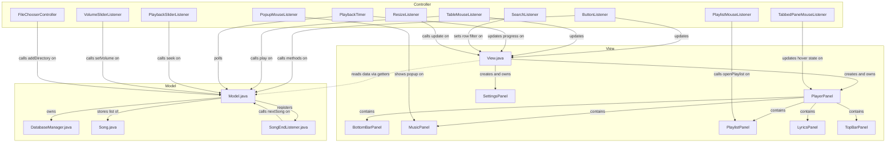
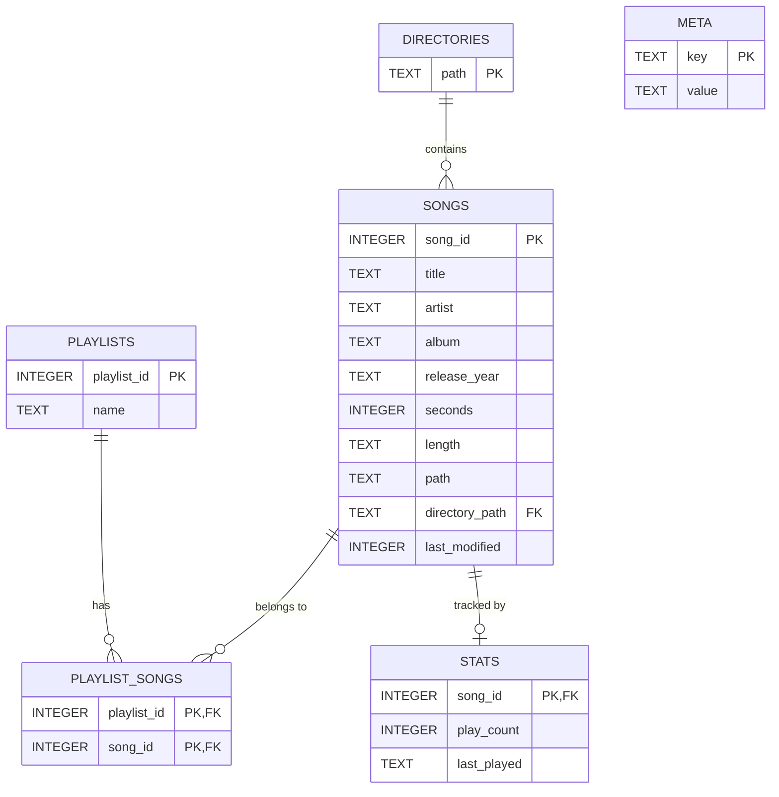
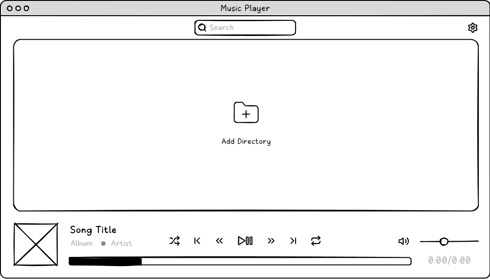
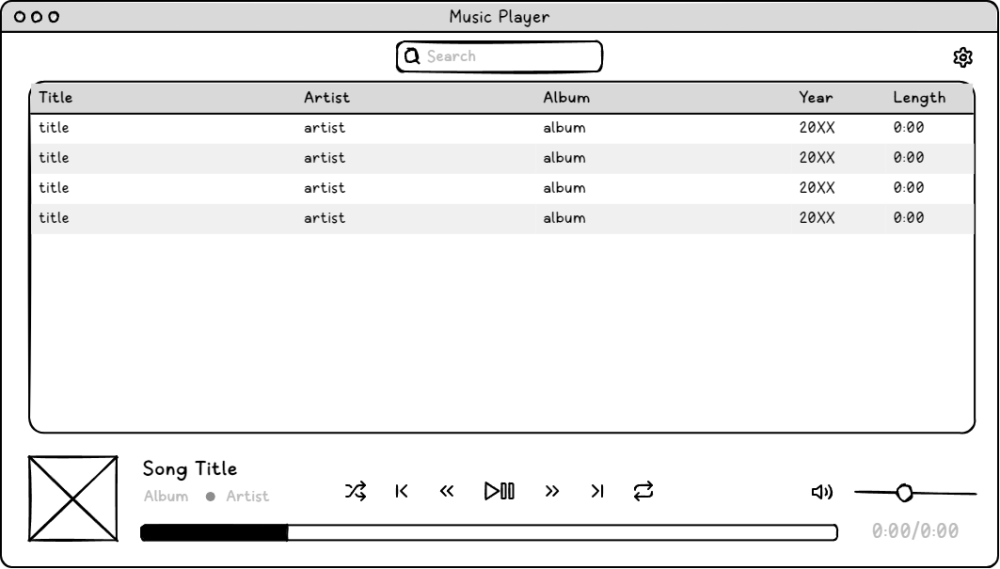
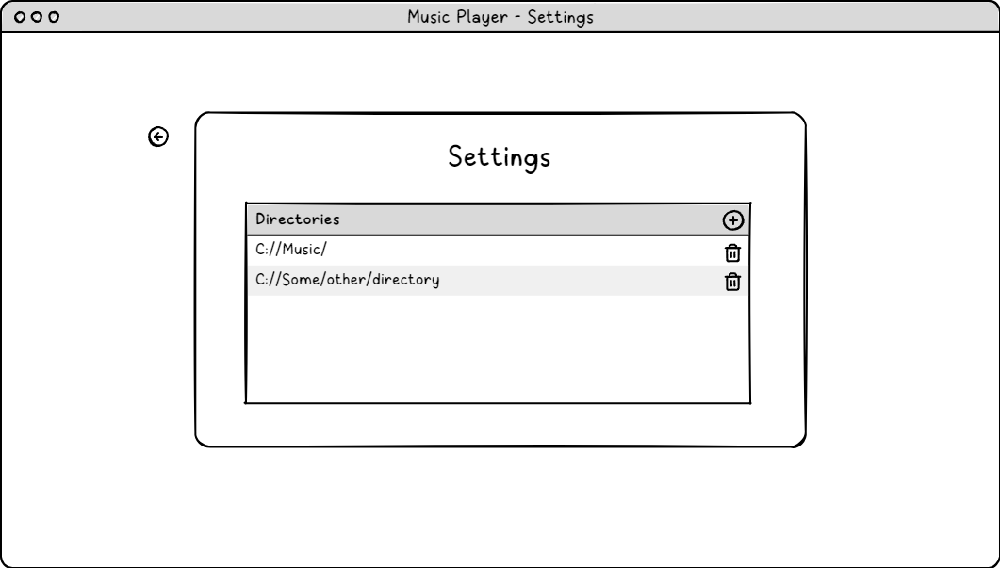
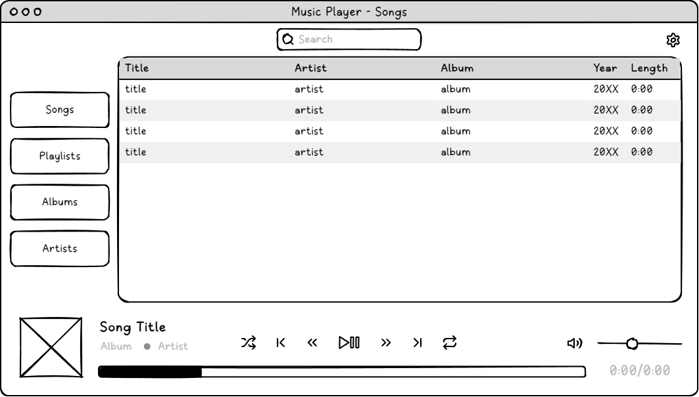
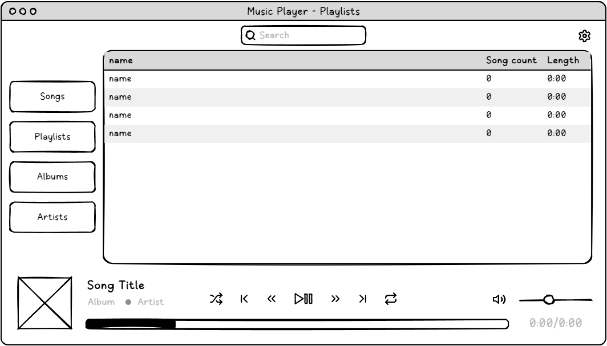
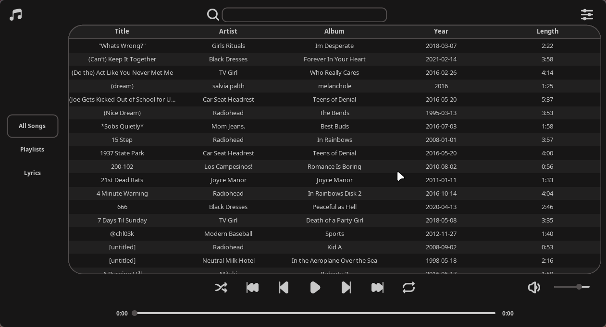
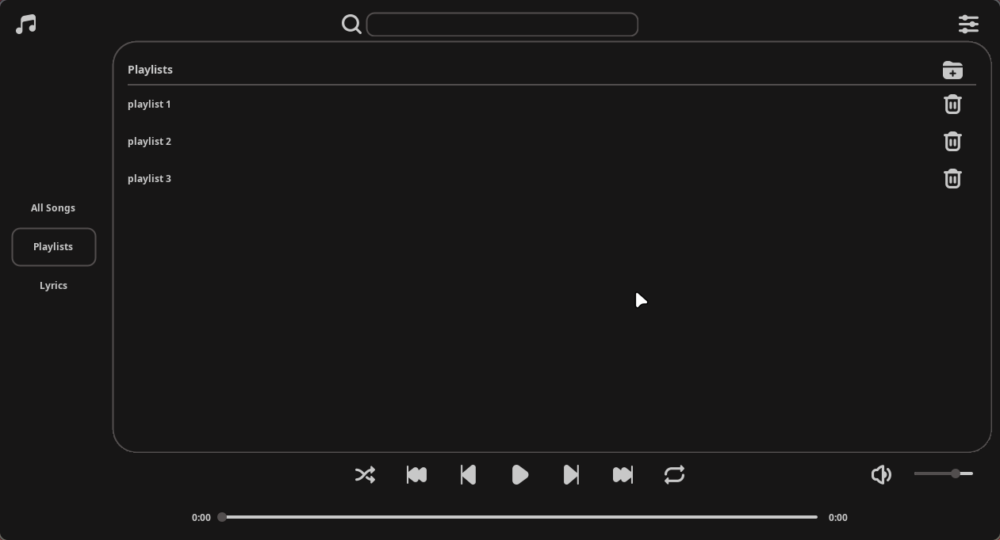
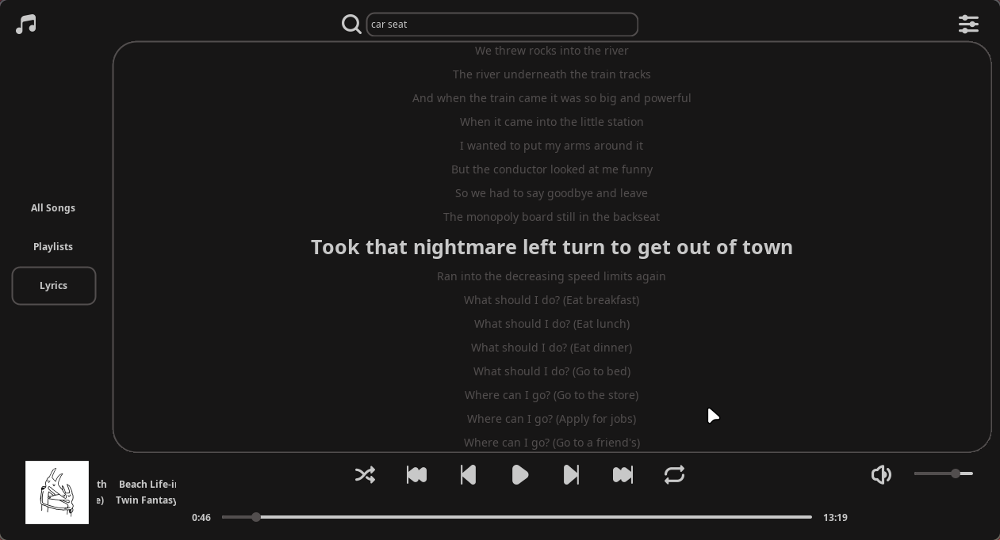

# Design Document

**Project:** MusicPlayer  
**Course:** COMP 2800 – Software Development  
**University of Windsor, School of Computer Science**  
**Term:** 2026W

---

## 1. Architecture Overview

MusicPlayer is built using the **Model-View-Controller (MVC)** design pattern.
MVC was chosen because it is the standard and well-documented pattern for
Java Swing applications.

The three layers are cleanly separated into Java packages:

- **Model** — owns all application data, audio playback, database access, and business
  logic. It has no knowledge of the UI
- **View** — builds and owns the Swing window and all UI components. It reads from the
  model through getters and delegates user actions to controllers
- **Controller** — a set of event listeners that sit between the view and the model.
  Each controller handles one category of user interaction and calls the appropriate
  model methods in response

---

## 2. MVC Diagram

The following diagram shows the relationships between the three layers and the key
classes within each:

---

## 3. Package Structure

| Package | Class | Responsibility |
|---|---|---|
|  | `MusicPlayer` | Entry point. Creates the Model and View |
| `model` | `Model` | Central data and logic class. Manages the queue, playback, directory scanning, LRC parsing, and stats image generation |
| `model` | `DatabaseManager` | All SQLite read and write operations across every table |
| `model` | `Song` | Data object holding a songs metadata and file path |
| `model` | `SongEndListener` | Beads audio event listener that triggers the next song when the current one ends |
| `view` | `View` | Top-level UI class. Owns the JFrame, CardLayout, and all panels. Stores global theme colors |
| `view` | `Icons` | Static utility class that loads and recolors all icon images at startup |
| `view.components` | `PlayerPanel` | Main player screen containing the top bar, tabbed pane, and bottom bar |
| `view.components` | `TopBarPanel` | Search bar and settings button at the top of the player |
| `view.components` | `BottomBarPanel` | Album art, song info, playback controls, progress bar, and volume slider |
| `view.components` | `MusicPanel` | Scrollable song table shared between the All Songs view and playlist views |
| `view.components` | `PlaylistPanel` | Manages the Playlists tab using a CardLayout to switch between the list and an open playlist |
| `view.components` | `LyricsPanel` | Displays synced or unsynced lyrics with smooth auto-scroll |
| `view.components` | `SettingsPanel` | Directory management and stats download controls |
| `view.components` | `MusicPlayerTabbedPane` | Custom JTabbedPane with vertically centered tabs and hover effects |
| `view.components` | `MusicPlayerTable` | Custom JTable with alternating row colors and themed header |
| `view.components` | `MusicPlayerTablePopup` | Right-click context menu for adding and removing songs from playlists |
| `view.components` | `MusicPlayerButton` | Custom JButton with rounded hover highlight |
| `view.components` | `MusicPlayerToggleButton` | Custom JToggleButton with selected state indicator for shuffle and repeat |
| `view.components` | `MusicPlayerSlider` | Custom JSlider with a flat rounded track and circular thumb |
| `view.components` | `ScrollingLabel` | JLabel that scrolls text horizontally when it is too wide to fit |
| `view.components` | `RoundedPanel` | JLayeredPane that clips its content to rounded corners |
| `view.components` | `RoundedBorder` | AbstractBorder that draws a rounded rectangle outline |
| `controller` | `ButtonListener` | Handles all button click events via action commands |
| `controller` | `TableMouseListener` | Handles double-click on the song table to start playback |
| `controller` | `PlaybackTimer` | Swing Timer that fires every 250ms to update the progress bar and pull metadata |
| `controller` | `PlaybackSliderListener` | Pauses playback while the user drags the progress slider and resumes on release |
| `controller` | `VolumeSliderListener` | Updates model volume in real time while the volume slider is dragged |
| `controller` | `SearchListener` | Applies a case-insensitive row filter to the song table on every keystroke |
| `controller` | `PlaylistMouseListener` | Opens a playlist when its row is clicked in the playlist list |
| `controller` | `PopupMouseListener` | Triggers the right-click context menu on the song table |
| `controller` | `ResizeListener` | Repaints the view when the window is resized |
| `controller` | `TabbedPaneMouseListener` | Tracks the hovered tab index for the custom tab hover highlight |
| `controller` | `FileChooserController` | Opens the directory picker dialog and passes the result to the model |

---

## 4. Database Schema

The application uses an embedded SQLite database with six tables. The schema is
documented in full in [`docs/schema.sql`](./schema.sql). The entity relationship
diagram below summarizes the table structure and foreign key relationships:

---

## 5. GUI Design

### 5.1 Development Goal 1 — v1.0.0

The initial development goal was a minimal working music player: a song table, a
settings panel for adding directories, and a fully functional bottom bar with all
playback controls. The wireframes below defined this goal at the start of the project.

**Figure 1 — Empty state (no directories added)**  

The empty state shows a prominent "Add Directory" prompt in the center of the song
table area, guiding the user toward the first action they need to take. In the final
implementation this prompt was removed in favour of simply showing an empty table.
The directory management was moved exclusively into the Settings panel to
make the codebase easier to maintain.

**Figure 2 — Song list with music loaded**  

The bottom bar layout matches the wireframe closely. One deliberate change was made
to the time display: the wireframe shows a combined `0:00/0:00` label on the right
side of the progress bar. In the final implementation this was split into two separate
labels — current time on the left and total length on the right — to match the common
design convention used by most music players.

**Figure 3 — Settings panel**  

The settings panel is consistent between both development goals and closely matches
the final implementation. Only addition made was a button that outputs the users listening statistics.

---

### 5.2 Development Goal 2 — v1.1.0

The second development goal expanded the application with a tabbed navigation panel
on the left side, adding Playlists, Albums, and Artists views alongside the existing song table.
The Albums and Artists views which were assessed as non-essential for the current release and 
noted for future implementation. (see GitHub issues).
The Lyrics tab was added in this phase and was not present in the
original wireframes.

**Figure 4 — Tabbed layout with song list**  

**Figure 5 — Playlists view**  

---

### 5.3 Final Implementation Screenshots

The screenshots below show the application as built and released.

**Figure 6 — All Songs tab (v1.1.0)**  

The tabbed layout from Goal 2 is implemented with All Songs, Playlists, and Lyrics
tabs. The Albums and Artists tabs from the wireframe are not present in the current
release.

**Figure 7 — Playlists tab**  

**Figure 8 — Lyrics tab with synced lyrics**  

The Lyrics tab was not in the original wireframes and was added during v1.1.0
development. The active line is displayed at a larger size and the panel scrolls
smoothly to keep it centered.

---

## 6. Key Design Decisions

### 6.1 MVC Pattern
MVC was chosen as the architectural pattern because it is the standard and
well-documented approach for Java Swing applications. It allows the view and
controllers to be modified independently without touching the model, which was
important for a project where the UI went through two significant iterations.

### 6.2 Embedded SQLite over Flat Files
SQLite was chosen over a flat file approach such as storing song paths in a text file
for several reasons. It provides proper relational data with foreign keys and cascade
deletes, making operations like removing a directory and all its associated songs
atomic and safe. It also scales to large libraries without performance degradation and
requires no server installation since the database runs entirely as an embedded
library via `sqlite-jdbc`.

### 6.3 Beads Audio Engine over javax.sound
The Beads audio library was chosen over the standard `javax.sound` API because it
provides built-in support for FLAC and MP3 playback through its SPI integration with
`jflac` and `mp3spi`. It also offers a clean sample caching mechanism via
`SampleManager` which was used to pre-cache the next song in the queue in a background
thread, reducing the delay between tracks.

### 6.4 CardLayout for Screen Switching
A `CardLayout` was used to switch between the player screen and the settings screen
rather than creating and destroying panels on demand. This means both panels are
initialized once at startup and simply shown or hidden when needed, avoiding the
overhead of repeatedly constructing complex component trees.

### 6.5 Shared MusicPanel
The `MusicPanel` containing the song table is a single shared instance that is moved
between the All Songs tab and whichever playlist is currently open rather than creating
a new table for each view. This keeps the song list state including scroll position and
row selection consistent and avoids the cost of rebuilding the table component every
time a playlist is opened or closed.

### 6.6 Directory Management Moved to Settings
The initial wireframe placed an "Add Directory" prompt directly in the center of the
song table area when the library was empty. This was changed in the final implementation
so that all directory management lives exclusively in the Settings panel. This decision
was made to maintain a cleaner separation between the playback interface and the
configuration interface, and to make the relevant code easier to locate and maintain.